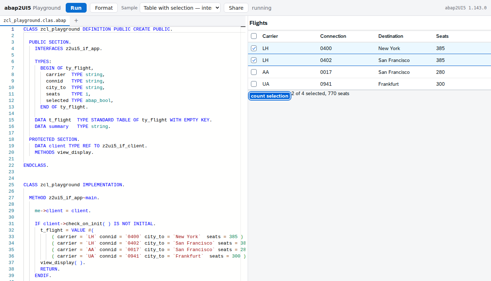

# abap2UI5 Playground

Write [abap2UI5](https://github.com/abap2UI5/abap2UI5) apps in the browser. ABAP
on the left, the running app on the right, and nothing in between but the
browser — no server, no SAP system, no backend of any kind.



## How it works

The [abaplint transpiler](https://github.com/abaplint/transpiler) translates ABAP
to JavaScript. abap2UI5 already relies on it — its CI transpiles the whole
framework and runs the ABAP unit tests under Node. The playground takes that
pipeline and moves the last step into the browser.

```
                     ┌──────────────────────── the page ────────────────────────┐
                     │                                                          │
  build time         │   Monaco + abaplint            the ABAP runtime          │
  ──────────         │   ┌─────────────────┐          ┌──────────────────┐      │
  abap2UI5 sources ──┼──▶│ registry:       │          │ abap2UI5,        │      │
  (910 files)        │   │ the real        │  Run     │ transpiled at    │      │
                     │   │ framework       │──ABAP───▶│ build time       │      │
  abap2UI5 src ──────┼──▶│ + your classes  │  → JS    │ + your classes   │      │
  downported,        │   └─────────────────┘          └────────┬─────────┘      │
  transpiled,        │                                         │ roundtrip      │
  bundled            │   ┌─────────────────────────────────────▼─────────┐      │
                     │   │ iframe: the abap2UI5 UI5 frontend             │      │
  OpenUI5 ───────────┼──▶│ window.fetch redirected to the runtime above  │      │
  built from npm     │   └───────────────────────────────────────────────┘      │
                     └──────────────────────────────────────────────────────────┘
```

- **Build time.** The abap2UI5 sources are downported to 702-compatible syntax
  (abaplint `--fix`), transpiled, and bundled into one static module along with
  the open-abap standard library. The UI5 frontend is built against a pinned
  OpenUI5, so the site carries its own UI5 rather than linking a CDN.
- **Page load.** That bundle boots the ABAP runtime, and an in-memory SQLite
  (sql.js, compiled to WebAssembly) takes the place of the database abap2UI5
  keeps its drafts in. In parallel, abaplint parses the real framework sources so
  the editor can check your classes against them.
- **Editing.** Monaco — the editor from VS Code — with abaplint behind it:
  diagnostics against the actual framework, hover, go to definition, rename,
  references, quick fixes and the pretty printer. Under the editor, a resizable
  panel with five tabs: every problem, an outline of the class, the log, and the
  configuration of each checker — editable, so "why is it not warning here?"
  has an answer you can try rather than only read.
- **A second opinion.** The [abap2UI5 linter](https://www.npmjs.com/package/@abap2ui5/linter)
  runs beside abaplint and answers a different question: abaplint says whether
  the ABAP compiles, the linter reconstructs the view your builder chain
  produces and says whether *that* works on UI5 1.71 — a control or property
  that release does not have, an icon that is in no icon font. Those compile,
  and at run time they render nothing and log nothing.
- **Run.** Only the classes in the editor are compiled, in about 20 ms, and
  registered with the running runtime.
- **Rendering.** The abap2UI5 frontend runs in an iframe and talks to its backend
  over a plain `fetch` POST, so the playground replaces `window.fetch` for that
  one request with a call into the framework in the parent page. From the
  framework's point of view nothing changed.

Roughly 3 MB travels to a visitor, compressed: the page bundle, the transpiled
framework, the ABAP corpus and SQLite. UI5 loads its libraries on demand on top
of that.

## What it can and cannot do

**It runs real abap2UI5.** Not a subset and not a simulation: the framework in
the page is the framework from the repository, at a pinned commit, and the
roundtrip it answers is the one a real system answers. Modern ABAP works as
written — inline declarations, `VALUE #( FOR … )`, `COND #`, string templates,
table expressions.

Where it stops:

- **A few classes, not a package.** The playground holds several ABAP files,
  named as abapGit names them, and **the first one is the app** - the playground
  starts the class it declares. What it does not have is anything else a package
  brings: no database tables of your own, no message classes, no CDS.
- **No database of your own, no RFC, no files.** There is a database, but it
  holds the framework's own tables. `SELECT` from a business table has nothing to
  select from, and nothing can reach outside the browser.
- **Only what the transpiler implements.** It covers a lot, and abap2UI5's whole
  CI depends on it, but it is not an ABAP kernel. Anything it cannot compile is
  reported in the output panel rather than failing silently.
- **Only the UI5 libraries that were built in.** `sap.m`, `sap.f`,
  `sap.ui.core`, `sap.ui.layout`, `sap.ui.table`, `sap.ui.unified`, `sap.tnt`,
  `sap.uxap`. A control from anywhere else will not load — see `UI5_LIBRARIES` in
  `tools/build-ui5.mjs`.
- **State lives in the tab.** Reloading the page starts over, and so does
  pressing Run. Your code is kept in local storage; the app's data is not.

Both halves follow your system's light or dark setting — the editor through
Monaco, the app through UI5's Horizon themes. Changing it while an app is
running recolours it in place rather than restarting it.

## Which problems it reports

abaplint runs with a deliberately small rule set: the ones that answer *would
this work*, not the ones that answer *is this the house style*. A playground
that underlines a missing pragma teaches nothing.

`check_syntax`, `parser_error`, `implement_methods`, `method_implemented_twice`,
`global_class`, `begin_end_names`, `superclass_final`, `unknown_types` —
checked against release v750, the one abap2UI5 lints itself against. The list
lives in `src/editor/registry.mjs`.

`definitions_top` is the rule that had to come **off** that list, and it is
worth naming: abap2UI5 enables it because the framework is downported to 702
before it is transpiled, and nothing here downports what is in the editor. It
was rejecting `FIELD-SYMBOLS` after a `CREATE DATA` — ABAP that compiles on
every system this playground is about — and an abaplint error stops Run, so the
reader was told to fix code that had nothing wrong with it.

The abap2UI5 linter runs its own rules on top, against UI5 **1.71** — the floor
abap2UI5 holds its own shipped apps to, and therefore the floor an example
copied out of the playground has to clear.

The two are kept apart on purpose, in the list and in what they block: an
abaplint error means the ABAP does not compile, so Run stops and says so. An
abap2UI5 finding means the app runs and is wrong somewhere — and the fastest
way to understand one is to look at the app it produced, so Run goes ahead.

**Fix them** appears over the list when something is repairable and says how
many — abaplint's own fixes and the linter's, applied together. It goes in as
one edit per file, so Ctrl+Z takes the whole rewrite back rather than unpicking
it fix by fix. Nothing that has no correct answer is guessed at: an icon that
does not exist stays reported rather than invented.

Both lists are only a default. The **abaplint** and **abap2UI5 lint** tabs hold
the live configuration: add any of abaplint's 188 rules, change the ABAP release
the syntax check holds you to, or lower the UI5 floor the view is checked
against to find a control an older system would not render. Apply reports how
many problems there are now, so a rule can be tried rather than argued about.

## Linking a playground

**Share** puts every open file in the URL fragment, deflated: a 2500-character
class becomes a link of about 700 characters. Being a fragment, it never leaves
the browser — it is not sent to the server and does not appear in any log.

**Full screen** opens the app on its own in a new tab — the whole window for the
app, none of the editor around it. It is the same URL Share writes plus
`?view=app`, so the new tab is a second playground rather than a window onto
this one: it compiles the code it was handed and runs it against a runtime of
its own. What happens back in the first tab — another Run, an edit, closing it —
leaves it alone.

**`?src=`** opens ABAP that lives somewhere else, which is what a documentation
page links when it wants to show its example running rather than only printed:

```
?src=https://raw.githubusercontent.com/abap2UI5/samples/main/src/z2ui5_cl_demo.clas.abap
```

Several `src` parameters open several files; the first is the app — and the
classes that app needs are looked for beside it and opened too, so a link to an
app that calls another app opens both. Only siblings in the same directory, only
from the hosts above, at most six files two levels deep; a name that is not
there is skipped in silence, because most of them are in the framework corpus
rather than in the repository. Code opened this way carries an **on GitHub**
link in the bar, following whichever file is
open — the raw URL the playground was given translated back into the page a
human would want, with the repository and the history around it. Sources are
limited to this site and GitHub's raw hosts — the playground fetches on behalf
of whoever opened the link, and should not be a general-purpose reader for
arbitrary URLs.

**`?embed=1`** drops the brand, the sample menu and the share button, leaving
the editor, Run and the app — for embedding in a documentation page. An
embedded playground never touches the stored draft, so it cannot overwrite what
a reader has open in a normal one. **`?view=app`** drops the editor too, for a
paragraph about what an app does rather than how it is written; the ABAP still
compiles and runs, it is simply not on screen.

## Live demos in a documentation page

`embed/abap2ui5-embed.js` turns an empty element into a running example:

```html
<div class="abap2ui5-demo"
     data-src="https://raw.githubusercontent.com/.../z2ui5_cl_demo.clas.abap"></div>
<script src="https://abap2ui5.github.io/playground/embed/abap2ui5-embed.js"></script>
```

`data-src` takes one URL or several (the first is the app), `data-code` carries
ABAP that lives only in that page, `data-view="app"` hides the editor,
`data-height` sets the starting height and `data-label` the button text. For a
documentation framework that swaps pages without reloading, call
`window.abap2ui5Embed.setUp()` after each navigation.

Inline code keeps **the name the page gave it**: the file it is put into is
named after the class in it, the way abapGit names one, so `data-code` carries
the example a manual prints under the name its reader is meant to create.

A page that draws its own button — because it wants one under a code block it
already styles — asks the loader for the URL instead of writing the fragment
itself:

```js
const href = await window.abap2ui5Embed.url({ code, view: "app" });
```

That matters more than it looks: a fragment the playground cannot read is
treated as somebody else's link and quietly replaced by the built-in sample, so
an encoder written by hand fails by showing the wrong code rather than by
failing.

**Nothing loads until the reader clicks.** Each demo is a whole ABAP runtime
plus an abaplint parse of nine hundred sources — a second or two of processor
and a few hundred megabytes, per frame. Demos on one page share the browser
cache, so the bytes are paid once, but the parsing is not; a page with ten
autoloading examples would be the slowest thing in the manual. `data-auto="1"`
overrides it where the page is about its one demo.

The app frame is served with UI5's `frameOptions` set to `allow` rather than the
`trusted` abap2UI5 ships. `trusted` means "only in a frame whose top window is
the same origin", and an embedded demo's top window is somebody else's manual:
UI5 asks it for permission over postMessage, waits ten seconds for an answer no
documentation site knows to give, and then hides everything it rendered — an
app that is in the DOM, correct and invisible, under a status bar saying
"running". What is unprotected is a demo compiled from code the embedding page
supplied, with no session and nobody's credentials.

An embedded playground posts three kinds of message to the page that framed it —
`ready` once it has something to show, `status` for each line its status bar
shows, and `height` for what an app-only demo wants to be. `embed/` on the
published site is a worked example of all of it, and is what the tests drive.

## Development

```sh
npm ci
npm run build     # pins deps, builds the framework, builds UI5, assembles dist/
npm run serve     # serves dist/ on http://localhost:8080
npm test          # Playwright, against a freshly built dist/
```

The first build takes a few minutes: the downport is three of them and the UI5
build one. Both are cached by a hash of their inputs, so the second build is
seconds.

| | |
|---|---|
| `tools/fetch-deps.mjs` | pins abap2UI5 and open-abap-core by commit under `deps/` |
| `tools/build-framework.mjs` | downport → transpile → `dist/runtime/framework.mjs` |
| `tools/build-ui5.mjs` | the abap2UI5 frontend built against OpenUI5 → `dist/app/` |
| `tools/build-site.mjs` | the page bundle and the ABAP corpus the editor uses |
| `tools/check-size.mjs` | the budget for what a visitor downloads |

`PG_DEBUG=1` builds the page and framework bundles unminified and with source
maps; without it neither ships one.

`src/runtime` is the ABAP side of the page, `src/editor` is Monaco and abaplint,
`src/shell` is the page around them, `src/abap` is the handful of ABAP the
playground adds to the framework, and `src/examples` is ABAP served as static
files so `?src=` has something to point at.

### Bumping abap2UI5 or OpenUI5

```sh
node tools/fetch-deps.mjs --print-latest   # what upstream has today
# edit the sha in tools/fetch-deps.mjs (or UI5_VERSION in tools/build-ui5.mjs)
npm run build && npm test
```

A weekly workflow (`.github/workflows/upstream.yml`) builds and tests against
upstream `HEAD` without changing the pins, and opens an issue when that stops
working — so a bump is a two-line commit rather than an investigation.

## Deployment

`.github/workflows/pages.yml` builds and publishes `dist/` to GitHub Pages on
every push to `main`, after the tests pass. `.github/workflows/check.yml` runs
the same build and tests on every other branch and pull request.

> **Setup required once, by a repository admin:** Settings → Pages → Source →
> "GitHub Actions". Until that is switched on the deploy job fails and the
> published page does not exist.

## Where the work is written down

[PLAYGROUND_PLAN.md](PLAYGROUND_PLAN.md) is the plan this was built from, phase
by phase, with what each phase turned out to cost and the traps found on the way
— the transpiler flag without which nothing links, the bundler option without
which ABAP's own type system stops working, the caches that have to be dropped
when a class is redefined. Read it before changing the build.

## License

MIT. abap2UI5, abaplint and OpenUI5 are the work of their respective authors and
carry their own licenses.
